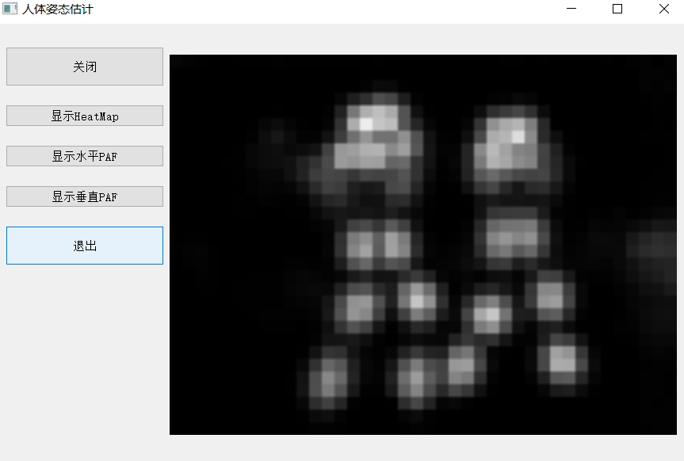
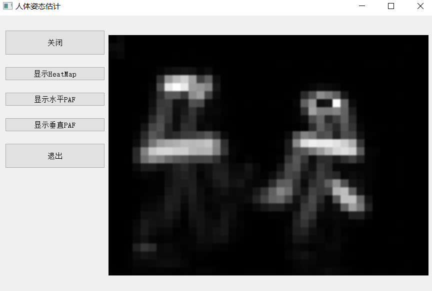

### Pose View Details
Human Pose Estimation is the task of localizing body parts and estimating the pose of every person in images and videos. This demo is based on OpenPose(https://github.com/CMU-Perceptual-Computing-Lab/openpose) and tf-pose(https://github.com/ildoonet/tf-pose-estimation), you and use it easily for detect pose in either a video or a webcam.
**You can run this demo easily with your device, even its performance is not too good**

### UI effect
This demo can show the pose of every person in a video or a webcam.

    

Besides, you can use the demo to show the heatmaps or vectormaps of all the persons in a media. 

    

    

### Dependencies
- python3
- tensorflow 1.5.0+
- opencv3, protobuf

### Quick Test
python poseGUI.py

### Models
You can download the models from my baiduyun, or use the pretrained model trained by tf-pose author more details on (https://github.com/ildoonet/tf-pose-estimation/tree/master/models).